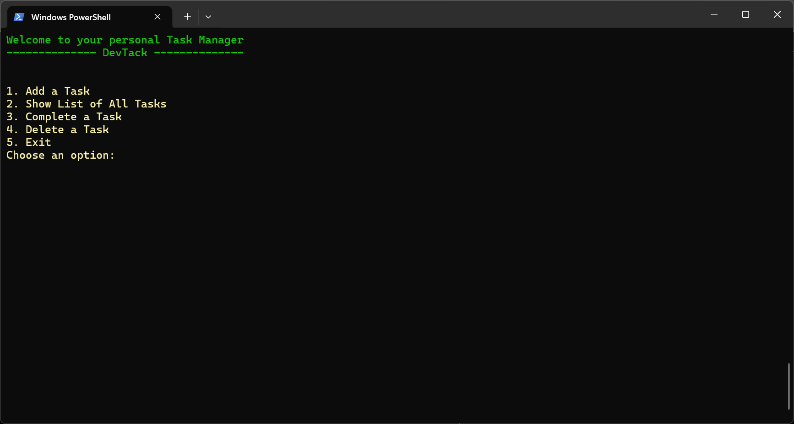
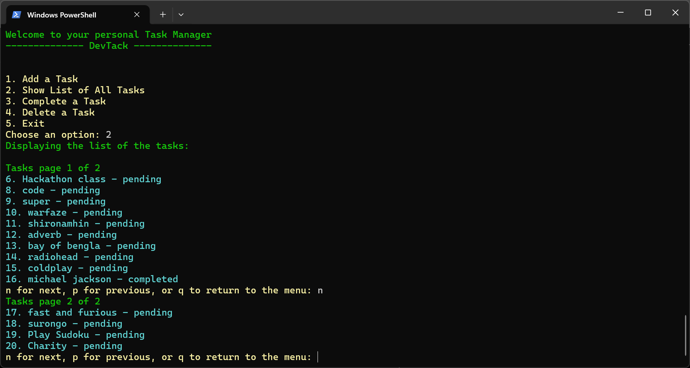
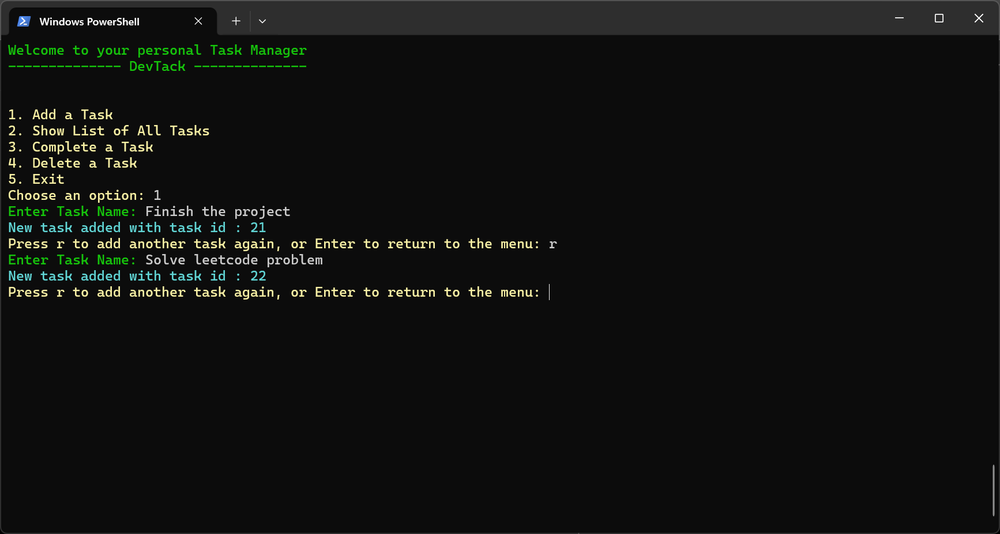
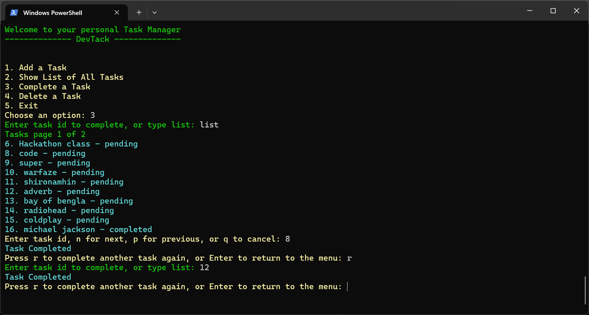

# DevTrack

DevTrack is a command-line task manager built with Python and MySQL. It provides task creation, completion tracking, deletion, and paginated task browsing through a Rich-powered terminal interface.

The project demonstrates database-backed CRUD operations, layered application design, input validation, and practical Python project organization.

## Quick Demo

1. Add a task  
2. View tasks with pagination  
3. Mark tasks as completed  
4. Delete tasks  

Built with Python, MySQL, and Rich.

---

## Screenshots

### Main Menu



### Task List With Pagination



### Adding Tasks



### Completing Tasks



---

## Features

- Add new tasks from the command line  
- View all tasks stored in MySQL  
- Paginated task listing for longer task lists  
- Mark tasks as completed  
- Delete tasks by ID  
- Basic input validation for task titles and task IDs  
- Rich console output for colored CLI messages  
- Automatic table creation on application startup  
- Layered structure with UI, service, model, and database modules  

---

## Tech Stack

- Python  
- MySQL  
- mysql-connector-python  
- python-dotenv  
- Rich  

---

## Installation

Clone the repository:

```bash
git clone https://github.com/asef-mahir/DevTrack-CLI.git
cd DevTrack-CLI
````

Create and activate a virtual environment:

```bash
python -m venv venv
```

On Windows PowerShell:

```powershell
venv\Scripts\Activate.ps1
```

On macOS/Linux:

```bash
source venv/bin/activate
```

Install dependencies:

```bash
pip install -r requirements.txt
```

---

## Environment Setup

Create a `.env` file in the project root:

```env
DB_HOST=localhost
DB_PORT=3306
DB_USER=root
DB_PASSWORD=your_mysql_password
DB_NAME=devtrack
```


---

## Database Setup

Make sure MySQL is installed and running. Then create the database:

```sql
CREATE DATABASE devtrack;
```

The application creates the required tables automatically when it starts.

Current task table schema:

```sql
CREATE TABLE IF NOT EXISTS tasks (
    id INT AUTO_INCREMENT PRIMARY KEY,
    title VARCHAR(255) NOT NULL,
    status ENUM('pending', 'completed') DEFAULT 'pending',
    created_at DATETIME DEFAULT CURRENT_TIMESTAMP,
    completed_at DATETIME NULL
);
```

---

## Running the Application

Run the app from the project root:

```bash
python -m app.main
```

The command should be run from the root folder, not from inside the `app` folder.

---

## Project Structure

```text
DevTrack/
├── app/
│   ├── database/
│   │   ├── connection.py
│   │   └── init_db.py
│   ├── models/
│   │   └── task_model.py
│   ├── services/
│   │   └── task_service.py
│   ├── ui/
│   │   ├── __init__.py
│   │   ├── common.py
│   │   └── task_menu.py
│   └── main.py
├── assets/
│   └── screenshots/
├── tests/
├── requirements.txt
└── README.md
```

---

## Architecture Notes

DevTrack uses a simple layered structure:

* `app/main.py` starts the application and handles top-level menu routing
* `app/ui/` contains CLI flows, prompts, pagination, and user interaction logic
* `app/services/` contains validation and business rules before database operations
* `app/models/` contains SQL queries for task persistence
* `app/database/` manages MySQL connection setup and table initialization

This separation keeps the project easier to maintain than a monolithic script.

---

## Learning Outcomes

This project demonstrates:

* Building a Python CLI application
* Connecting Python to a MySQL database
* Reading configuration from environment variables
* Organizing code into separate layers
* Writing parameterized SQL queries
* Handling user input and invalid values
* Implementing pagination in a terminal app
* Refactoring a growing script into a structured project

---

## Future Improvements

* Add automated tests for service and model behavior
* Improve task listing with sorting or filtering
* Add search by task title or status
* Package the CLI as an installable command-line tool

---

## Status

DevTrack is a learning-focused portfolio project. It is not intended to be a full productivity platform, but it demonstrates practical Python, MySQL integration, CLI design, and project organization in a clean and structured way.

```